# FunkcionálisSpecfikáció

## 1. Rendszer céljai és nem céljai

### A rendszer céljai:

**Usereknek:**  
&nbsp;&nbsp;&nbsp;&nbsp;Egy olyan weboldal biztosítása, amely naprakész információkat közöl a felhasználókkal, ha azok szeretnének érdeklődni a komplexum szolgáltatásai iránt. Lehetőség van regisztrálni a weboldalra így a regisztrált felhasználó többféle weboldal funkciót is elérhet. Használhatja a fórumot, időpontot foglalhat egyes szolgáltatásokra pár kattintással és egyéni edzésterv kalkulátorunkkal személyre szabott edzést is létrehozhat.  
&nbsp;&nbsp;&nbsp;&nbsp;A galéria a komplexumról és annak környékéről, szolgáltatásokról, öltözőről, zuhanyzókról fog képet tartalmazni. Ezt a galéria menüpont alatt lesz elérhető.  
&nbsp;&nbsp;&nbsp;&nbsp;A weboldalon elérhető lesz egy online webshop, ahol a komplexum egyéni termékeit lehet megrendelni. 
Kapcsolat menüpont alatt pedig az elérhetőségek fognak helyet kapni, illetve egy google maps térkép, amely segít könnyebben megtalálni a komplexumot.  
**Dolgozóknak:**  
&nbsp;&nbsp;&nbsp;&nbsp;A dolgozók kitüntetett felhasználókként jelennek meg a rendszerben. Nekik hozzáférésük van a weboldal managelését elősegítő oldalhoz is. Ezen az oldalon szerkeszteni tudják az egyes szolgáltatások képeit, információit, elérhetőségeket stb.
Személyre szabott edzésterveket is lehetőségük van létrehozni/megosztani a vendégekkel.
A saját profil adatoknál a saját beosztásukat/munkarendet is megtekinthetik.  
**Főnöknek:**  
&nbsp;&nbsp;&nbsp;&nbsp;Minden olyan funkcióval rendelkezik, mint egy dolgozó, vendég. Ezen kívül hozzáfér a saját bérkalkuláció hoz, alkalmazott nyilvántartáshoz.  

### A rendszernek nem célja:  

- Szolgáltatásokért lehetőség legyen online fizetni és jegyet váltani.
- A beszerzési rendszerrel való integráció.
- Biztonsági rendszerrel való integráció.
- Hírlevél létrehozása és küldése.
- Állatok jólétét elősegítő rendszerek integrációja. Beleértve az automata etetők, szűrőrendszer és vízhőmérséklet/koncentráció mérés.

## 4. Megfeleltetés, hogyan fedik le a használati esetek a követelményeket.

### Követelményspecifikáció 5.1.1: 

- Online regisztrációs felület &check;
    - Felhasználó/jelszó alapú belépés &check;

### Követelményspecifikáció 5.1.2:

- Online/Lokális személyzet nyilvántartása &check;
    - Felhasználó/jelszó alapú belépés &check;
    - Műszak/ledolgozott órák számának megtekintése/jelenleg megkeresett fizetés &check;

### Követelményspecifikáció 5.1.3:

- Online felületért felelős céges dolgozók legyenek képesek új termék feltöltésére/személyes edzés|táplálkozás feltöltésére/új információk feltöltése szolgáltatásainkkal kapcsolatban &check;

### Követelményspecifikáció 5.1.4:

- Időpontfoglalás a vendégek számára &check;
    - Lefoglalt időpontok megjelenítése/Tiltása, ha foglalt &check;
        - Időpontfoglalás &check;

### Követelményspecifikáció 5.1.5:

- Kapcsolat/Elérhetőség megjelenítése &check;
    - Cím/Telefonszám/E-mail/Bolt Telefonszám/Bolt e-mail/Google térkép &check;

### Követelményspecifikáció 5.1.6:

- Galéria &check;
    - Medencék, akváriumok, szolgáltatásaink helyszíne &check;

### Követelményspecifikáció 5.1.7:

- Menüsor &check;
- Keresés &cross;
    - A funkcionalitás a Bolt szekcióban lesz elérhető, külön nem.

### Követelményspecifikáció 5.1.8:

- Online Rendelés esetén a komplexum bankszámlaszáma a megfelelő menüpontban &check;

### Követelményspecifikáció 5.1.9:

- Fórum lehetősége ahol véleményezhetik a regisztrált felhasználóink szolgáltatásainkat &check;
    - Csak bejelentkezés után lehet igénybe venni

### Követelményspecifikáció 5.1.10:

- Reszponzív weboldal &check;

## 7. Követelménylista

- Olyan weboldal létrehozása, amely egyszerű, egyértelmű, naprakész információkat tartalmaz és könnyű hozzáférést biztosít a felhasználóknak.  
- Célunk az egyszerűség, szeretnénk minden korosztálynak elérhető és informatív oldalt létrehozni.  
- Naprakész információkkal látjuk el a honlap látogatóit, illetve sok hiteles ajánlást is olvashatnak.  
- A weboldal tartalmaz egy regisztrációs és egy belépést kezelő felületet.

## 8. Használati esetek[use case]
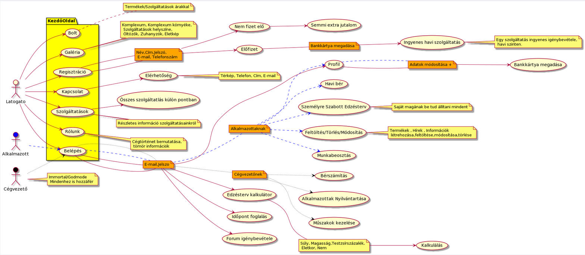

## 9. Forgatókönyvek

**Belépés:**

&nbsp;&nbsp;&nbsp;&nbsp;A felhasználó beírja a böngészőbe az URL címét a weboldalnak. Ezután betöltődik a weboldal index (home) oldala. Itt már szépen látszani fog az oldal menüpontjai között a belépés lehetőség. Erre a menüpontra kattintva átirányítás történik a belépés oldalra. Ezen az oldalon egy belépés form fogja várni a felhasználót. Az email és a jelszó mezők kitöltése kötelező érvényű. Ha begépelte az email-jelszó párost akkor két lehetőség történhet.  
- Belépés gombra kattintva hibaüzenetet kapunk. Ekkor az történt, hogy hibás authentikáció révén rossz belépési adatokat adunk meg.
- Belépés gombra kattintva nem kapunk hibaüzenetet, helyette ismét az index oldalra kapunk átirányítás. Megjelenik a menüsorban az account név és egyéb lehetőségek, amelyekhez a user hozzáférhet.

**Regisztráció:**

&nbsp;&nbsp;&nbsp;&nbsp;A felhasználó beírja a böngészőbe az URL címét a weboldalnak. Ezután betöltődik a weboldal index (home) oldala. Itt már szépen látszani fog az oldal menüpontjai között a regisztráció lehetőség. Erre a menüpontra kattintva átirányítás történik a regisztrációs oldalra. Ezen az oldalon egy regisztrációs form fogja várni a felhasználót. A regisztrációs adatmezők (név, lakcím, email, telefon, jelszó) kitöltése kötelező. Ha valamely mezőt üresen hagyjuk nem bírunk regisztrálni és az üresen hagyott mezőn megjelenik egy hibaüzenet. Ha minden mezőt kitöltöttek és rákattintunk a regisztráció gombra akkor két opció történhet:
- Hibaüzenetet kapunk. Egy felhasználó már használja azt az emailt, amelyet megadtunk. Ebben az esetben egy új email cím megadása kötelező!
- Sikeres regisztráció! Megjelenik egy sikeres regisztrációt jelző üzenet, illetve információt kapunk a belépés opcióról is. 

**Szolgáltatások:**

&nbsp;&nbsp;&nbsp;&nbsp;A szolgáltatások menüpontra kattintva átirányítás történik a szolgáltatások oldalra. Itt az összes szolgáltatás megtalálhatóak “card” listába szervezve. Ha a felhasználó rákattint az egyik card-ra, akkor legördül egy blokk az összes arra a szolgáltatásra vonatkozó információval.

**Profil:**

&nbsp;&nbsp;&nbsp;&nbsp;A felhasználó saját profil menüpontjára kattintva a profil oldalon találja magát. Itt lehetősége van megadni a saját profiljára vonatkozó további információkat pl.: bankszámlaszám. Illetve tudja szerkeszteni a már meglévő adatait is. *Esetleg még extra funkcióként profilképet is lehessen beállítani.

**Galéria:**

&nbsp;&nbsp;&nbsp;&nbsp;A galéria menüpontra kattintva a galéria oldalon találjuk magunkat. Itt különböző kis táblázatos elrendezésű cardokat találunk, amiken képek vannak. Ha ezekre a cardokra rákattintunk akkor nagyításba megjelenik a kattintott kép.

## 10. Funkció – követelmény megfeleltetés

A használati esetek - követelmények megfeleltetéséből látszik, hogy lényegében minden követelményt lefedtünk.  

A követelményspecifikáció(ebben a részben a fejezetszámokat használjuk ezután) 5.1.1-es pontjában leírtaknak megfelelően online regisztrációs felülettel, illetve felhasználónév és jelszó alapú beléptetéssel fog rendelkezni a weboldal.  

A személyzet nyilvántartása szintén felhasználónév és jelszó alapú bejelentkezéssel lesz elérhető az 5.1.2-es pont alapján. Itt megtekinthető lesz a ledolgozott órák száma, illetve az adott időpontig megkeresett fizetés.  

Az 5.1.3-as pont alapján az online felületért felelős céges dolgozók képesek lesznek új termék(ek) feltöltésére, személyes edzés és táplálkozás feltöltésére, valamint a szolgáltatásokkal kapcsolatban új információk feltöltésére.  

A weboldalon a vendégek számára időpontfoglalásra is lesz lehetőség. A weboldalon meg fognak jelenni megkülönböztetve a lefoglalt időpontok, és ezekben már a rendszer nem fogja engedni a felhasználónak az időpontfoglalást az 5.1.4-es pont alapján.  

Az 5.1.5-ös és 5.1.6-os pontok alapján a weboldalon megtalálható lesz a komplexum elérhetősége és a galéria, ahol a felhasználók megtekinthetik képeken a komplexumot.  

A weboldalon való navigálást a menüsor fogja lehetővé tenni az 5.1.7-es pont alapján. A keresés funkció csak a Bolt szekcióban lesz elérhető, viszont külön nem.  

A weboldalon online rendelés esetén meg fog jelenni a komplexum bankszámlaszáma a megfelelő menüpontban az 5.1.8-as menüpont alapján.  

Az 5.1.9-as pont alapján implementálni fogunk egy felhasználói fórumot, ahol a szolgáltatások igénybevevői tudják értékelni a komplexumot saját tapasztalataik alapján. Ezt csak bejelentkezés után lehet igénybe venni.  

Mivel manapság alapelvárás, ezért reszponzív weboldalt fogunk készíteni. Ez összhangban van az 5.1.10-es ponttal.

## 11. Fogalomszótár

**HTML5:** A HTML5 a HTML (Hypertext Markup Language, a web fő jelölőnyelve) korábbi verzióinak az átdolgozott változata. A kifejlesztésének egyik fő célja, hogy a webes alkalmazásokhoz ne legyen szükség pluginek (pl. Adobe Flash, Microsoft Silverlight, Oracle JavaFX) telepítésére. 
*Forrás: https://hu.wikipedia.org/wiki/HTML5*  

**Php:** A PHP egy általános szerveroldali szkriptnyelv dinamikus weblapok készítésére. Az első szkriptnyelvek egyike, amely külső fájl használata helyett HTML oldalba ágyazható. A kódot a webszerver PHP feldolgozó modulja értelmezi, ezzel dinamikus weboldalakat hozva létre.
*Forrás: https://hu.wikipedia.org/wiki/PHP*  

**Css:** A CSS (Cascading Style Sheets, magyarul: lépcsőzetes stíluslapok) a számítástechnikában egy stílusleíró nyelv, mely a HTML vagy XHTML típusú strukturált dokumentumok megjelenését írja le. Ezenkívül használható bármilyen XML alapú dokumentum stílusának leírására is, mint például az SVG, XUL stb. A CSS specifikációját a World Wide Web Consortium felügyeli.
*Forrás: https://hu.wikipedia.org/wiki/Cascading_Style_Sheets*  

**Png:** A PNG (Portable Network Graphics) képek tárolására, veszteségmentes tömörítésére alkalmas fájlformátum. Kiterjesztésként a .png írásmóddal használják. 
*Forrás: https://hu.wikipedia.org/wiki/PNG*  

**Jpeg:** A JPEG – (Joint Photographic Experts Group) képek tárolására alkalmas fájlformátum. Kiterjesztéseként a .jpeg, .jpg, ritkábban a .jpe használt. A JPEG normát 1992-ben fogadták el, ami különböző képtömörítési módokat ír le. A képen lévő információt veszteségesen tömöríti ez a formátum.
*Forrás: https://hu.wikipedia.org/wiki/JPEG*  

**Címsor:** A webböngészőkben a címsor vagy címsáv (address bar, location bar, URL bar) a böngésző ablakának az a része (vezérlőeleme vagy controlja), ami az aktuálisan mutatott weboldal URL-jét mutatja, illetve lehetővé teszi a betöltendő URL begépelését. A legtöbb böngészőben működik az automatikus kiegészítés a cím beírása közben – ez általában a böngészési előzmények alapján történik. 
*Forrás: https://hu.wikipedia.org/wiki/C%C3%ADmsor_(b%C3%B6ng%C3%A9sz%C5%91elem)*  

**Regisztráció:** A felhasználó saját adatai(email cím, jelszó) megadásával be tud regisztrálni az oldalra, így több funkciót (webshop, akciókról email) ér el és előnyökhöz (gyorsabb vásárlás) is juthat.

**Belépés:** A regisztráció után, a felhasználónak csak be kell lépnie az oldalra, így nem kell mindig regisztrálnia.

**URL:** Az URL vagy más néven webcím (mely a Uniform Resource Locator [egységes erőforrás-helymeghatározó] rövidítése), az interneten megtalálható bizonyos erőforrások (például szövegek, képek) szabványosított címe. 
*Forrás: https://hu.wikipedia.org/wiki/URL*  

**Menüsor:** Az aktív weboldalon használható parancsok csoportjai. 
*Forrás: https://informatika.gtportal.eu/?f0=szotar*  

**Hibajavítás:** Az informatikában és az információelméletben fontos gyakorlati kérdés a hibák felismerése és kijavítása. A hibafelismerés egy képesség az adó és a vevő közötti átvitel folyamán a zaj vagy egyéb zavar okozta rendellenességek miatti torzulások jelzésére. A hibajavítási képesség lehetővé teszi a hiba helyének felismerését és kijavítását is. 
*Forrás: https://hu.wikipedia.org/wiki/Hibajav%C3%ADt%C3%A1s*  

**Felhasználó:** A felhasználó (user) az a személy (végfelhasználó, end-user) vagy szoftver ágens, aki egy számítógépes vagy számítógép-hálózati szolgáltatás használója. A felhasználóhoz gyakran felhasználói fiók tartozik, amit felhasználói név (username, screen name, nick vagy handle) azonosít. 
*Forrás: https://hu.wikipedia.org/wiki/Felhaszn%C3%A1l%C3%B3*  

**Felhasználónév:** Egy egyedi azonosító, amit a felhasználó maga választ, sose lehet két azonos felhasználónév. A belépéshez szükséges egyik adat.

**Jelszó:** A belépéshez szükséges másik adat, minden felhasználó maga választja.

**Google térkép navigáció/kezelése:** A Google Térkép (angolul: Google Maps) a Google által fejlesztett ingyenes internetes térképszolgáltatás. Az elérhető térképek és műholdfelvételek az egész Földet lefedik. 
*Forrás: https://hu.wikipedia.org/wiki/Google_T%C3%A9rk%C3%A9p*  

**Termék feltöltése:** Az erre a feladatra kijelölt emberek tudnak feltölteni webshopba új termékeket, amiket a vásárlók meg tudnak vásárolni.

**Webszerver:** A webkiszolgáló/webszerver egy kiszolgáló, amely elérhetővé teszi a helyileg (esetleg más kiszolgálón) tárolt weblapokat a HTTP protokollon keresztül. A HTTP webszerverekhez webböngészőkkel lehet kapcsolódni.

**XAMPP:** A XAMPP – (kiejtése: /ˈzæmp/ vagy /ˈɛks.æmp/[1]) – egy szabad és nyílt forrású platformfüggetlen webszerver-szoftvercsomag, amelynek legfőbb alkotóelemei az Apache webszerver, a MariaDB (korábban a MySQL[2]) adatbázis-kezelő, valamint a PHP és a Perl programozási nyelvek értelmezői (végrehajtó rendszerei). Ez a szoftvercsomag egy integrált rendszert alkot, amely webes alkalmazások készítését, tesztelését és futtatását célozza, és ehhez egy csomagban minden szükséges összetevőt tartalmaz. A rendszer egyik nagy előnye az összehangolt elemek könnyű telepíthetősége.
*Forrás: https://hu.wikipedia.org/wiki/XAMPP*  

**Bootstrap 4:** Bootstrap is a free and open-source CSS framework directed at responsive, mobile-first front-end web development. It contains CSS- and (optionally) JavaScript-based design templates for typography, forms, buttons, navigation, and other interface components.
*Forrás: https://en.wikipedia.org/wiki/Bootstrap_(front-end_framework)*  

**Javascript:** A JavaScript programozási nyelv egy objektumorientált, prototípus alapú szkriptnyelv, amelyet weboldalakon elterjedten használnak.
*Forrás: https://hu.wikipedia.org/wiki/JavaScript*  

**Felhasználó autentikáció:** A hitelesítés azt az azonosítási folyamatot jelenti, melynek során egy személy, bizonyítja, hogy rendelkezik megfelelő hitelesítő adatokkal. Többféle hitelesítő módszer létezik, melyek közül a legegyszerűbb a felhasználónevek és jelszavak alkalmazása, de ide tartozik a digitális aláírás és a biometriai azonosítás is.
*Forrás: https://www.fogalomtar.hte.hu/wiki/-/wiki/HTE+Infokommunikacios+Fogalomtar/Hiteles%C3%ADt%C3%A9s*  

**ID:** Azonosító

**Reszponzív webdesign:** A reszponzív weboldal (RWD) egy olyan megközelítéssel tervezett weboldal, amelynek a célja az, hogy optimális megjelenést biztosítson - könnyű olvashatóság, egyszerű navigáció a lehető legkevesebb átméretezéssel és görgetéssel - a legkülönfélébb eszközökön (az asztali számítógép monitorjától egészen a mobiltelefonokig). Egy reszponzív elv alapján tervezett oldal tökéletesen igazodik a megjelenítő eszközhöz, mindezt rugalmas felépítéssel, flexibilis képekkel.
*Forrás: https://hu.wikipedia.org/wiki/Reszponz%C3%ADv_weboldal*  

**Áttűnés:** A weboldalon a menüpontokra kattintva különböző mozgásokkal, effektekkel jöhetnek elő az ablakok, képek vagy újabb menüpontok. Ezeket nevezzük áttűnéseknek.

**Hamburger menü:** The hamburger button, so named for its unintentional resemblance to a hamburger, is a button typically placed in a top corner of a graphical user interface.[1] Its function is to toggle a menu (sometimes referred to as a hamburger menu) or navigation bar between being collapsed behind the button or displayed on the screen. The icon which is associated with this widget, consisting of three horizontal bars, is also known as the collapsed menu icon.
*Forrás: https://en.wikipedia.org/wiki/Hamburger_button*  

**Link:** Hiperhivatkozás (angolul hyperlink), más néven link, ugrópont, kapocs, a hiperszöveges és a hipermediális rendszerek elemeit, objektumait összekötő eszköz. Értelmezéséhez különleges, számítógépes alkalmazásra van szükség.
Hiperhivatkozással legtöbbször az internet böngészése közben találkozhatunk, ahol a hasonló témájú információk így vannak összekötve.
*Forrás:https://hu.wikipedia.org/wiki/Hiperhivatkoz%C3%A1s*  

**Átirányítás:** Átirányításnak azt nevezzük, amikor egy lap nem tartalmaz szöveget, hanem csak egy hivatkozást egy másik lapra, a céllapra. Ha rákattintunk egy átirányító lapra mutató belső hivatkozásra, akkor automatikusan a céllapra jutunk. Ha ezt a belső linket zöld színben látod, akkor a te beállításaidban, ahol ki-bekapcsolható, be van kapcsolva az a segédeszköz, hogy az átirányításra mutató belső linkek kék helyett zölden jelenjenek meg.
*Forrás: https://hu.wikipedia.org/wiki/Wikip%C3%A9dia:%C3%81tir%C3%A1ny%C3%ADt%C3%A1s*  

**Session/Munkamenet:** A munkamenet (angolul session) a számítógép-hálózatoknál két számítógép közötti kommunikáció olyan formája, mely során az egyik (vagy mindkét) gép átmenetileg adatokat tárol a másikról; ennek segítségével egy állapotmentes protokollon keresztül is lehet állapotokat megőrizve kommunikálni.
*Forrás: https://hu.wikipedia.org/wiki/Munkamenet*  

**MySQL:** A MySQL egy többfelhasználós, többszálú, SQL-alapú relációs adatbázis-kezelő szerver.
*Forrás: https://hu.wikipedia.org/wiki/MySQL*  

**Relációs adatbázis:** Relációs adatbázisnak nevezzük a relációs adatmodell elvén létrehozott adatok összességét, a relációs adatmodell fogalomrendszerében meghatározott ún. relációk egy véges halmazát. Relációs adatbázisokat relációsadatbázis-kezelőkkel hozhatunk létre, szerkeszthetünk és törölhetünk.
*Forrás: https://hu.wikipedia.org/wiki/Rel%C3%A1ci%C3%B3s_adatb%C3%A1zis*  

**Adatbázis:** Az adatbázis azonos minőségű (jellemzőjű), többnyire strukturált adatok összessége, amelyet egy tárolására, lekérdezésére és szerkesztésére alkalmas szoftver eszköz kezel.
*Forrás: https://hu.wikipedia.org/wiki/Adatb%C3%A1zis*  

**Szövegdoboz:** A szöveg tördeléséhez használhatunk szövegdobozokat így látványosabban tudunk elkülöníteni bekezdéseket vagy témákat.

**Szövegmező:** A Szövegmező típusú mező egy rövid, általában néhány szóból álló szabad szöveg bevitelére, megadására szolgál. A kitöltőket a "Kitöltési segédlet"-be írt instrukciókkal, szövegmező maszk, illetve reguláris kifejezés (regexp) alkalmazásával lehet befolyásolni abban, hogy a szabad szöveges válaszadási lehetőség ellenére, összehasonlítható, kiértékelhető válaszokat adjanak.
*Forrás: https://www.infoartnet.hu/urlap-szovegmezo*  

**Checkbox:** A checkbox (check box, tickbox, tick box) is a GUI widget that permits the user to make a binary choice, i.e. a choice between one of two possible mutually exclusive options. For example, the user may have to answer 'yes' (checked) or 'no' (not checked) on a simple yes/no question.
*Forrás: https://en.wikipedia.org/wiki/Checkbox*  

**Űrlap:** Az űrlapokat a weboldalak készítésénél számos célra felhasználhatjuk, például arra, hogy segítségével a látogatók üzenetet, visszajelzést küldhessenek az üzemeltetőnek, árukat rendelhessenek, bejelentkezhessenek, és így tovább.
*Forrás: http://tamop412.elte.hu/tananyagok/weblapkeszites/lecke9_lap1.html*  

**HTTP metódusok:** HTTP protokoll nyolcféle metódust definiál. A metódusok (más szóval verbek) a megadott erőforráson végzendő műveletet határozzák meg.
 - HEAD: Ugyanazt adja vissza, mint a GET, csak magát az üzenettestet hagyja ki a válaszból.  
 - GET: A megadott erőforrás letöltését kezdeményezi. Ez messze a leggyakrabban használt metódus.  
 - POST: Feldolgozandó adatot küld fel a szerverre. Például HTML űrlap tartalmát. Az adatot az üzenettest tartalmazza.  
 - PUT: Feltölti a megadott erőforrást.  
 - DELETE: Törli a megadott erőforrást.  
 - TRACE: Visszaküldi a kapott kérést. Ez akkor hasznos, ha a kliens oldal arra kíváncsi, hogy a köztes gépek változtatnak-e, illetve mit változtatnak a kérésen.  
 - OPTIONS: Visszaadja a szerver által támogatott HTTP metódusok listáját.  
 - CONNECT: Átalakítja a kérést transzparens TCP/IP tunnellé. Ezt a metódust jellemzően SSL kommunikáció megvalósításához használják.  
*Forrás: https://hu.wikipedia.org/wiki/HTTP#Met%C3%B3dusok*  

**Kliens-szerver modell:** A kliens-szerver (magyarul: ügyfél-kiszolgáló) kifejezést először az 1980-as években használták olyan számítógépekre (PC-kre) amelyek hálózatban működtek. A ma ismert modell a 80-as évek végén vált elfogadottá. A kliens-szerver szoftverarchitektúra egy sokoldalú, üzenetalapú és moduláris infrastruktúra amely azért alakult ki, hogy a használhatóságot, rugalmasságot, együttműködési lehetőségeket és bővíthetőséget megnövelje a centralizált, nagyszámítógépes, időosztásos rendszerekhez képest.
*Forrás: https://hu.wikipedia.org/wiki/Kliens-szerver_architekt%C3%BAra*  

## 10. Képernyőtervek

|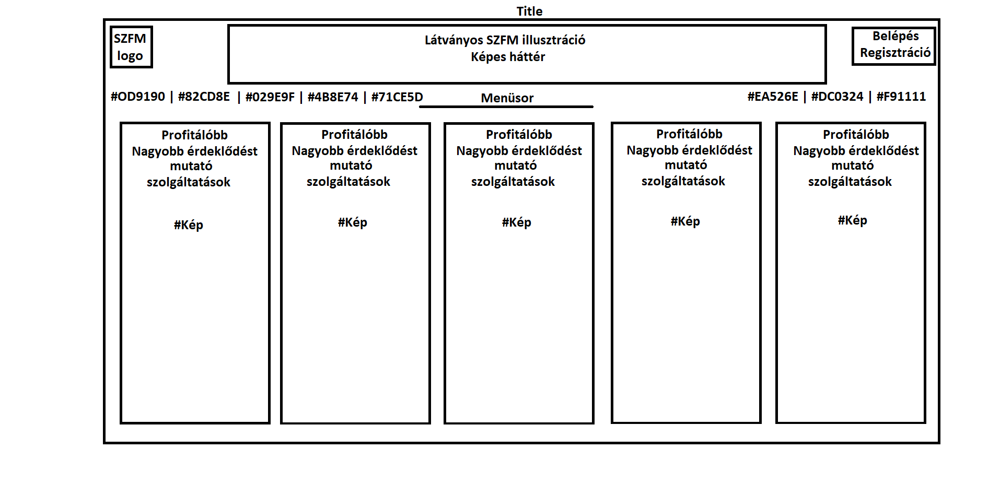|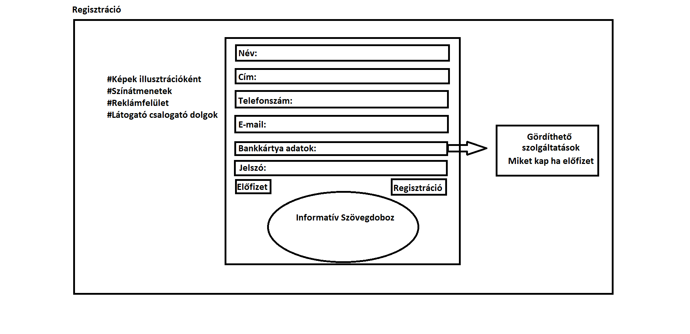| 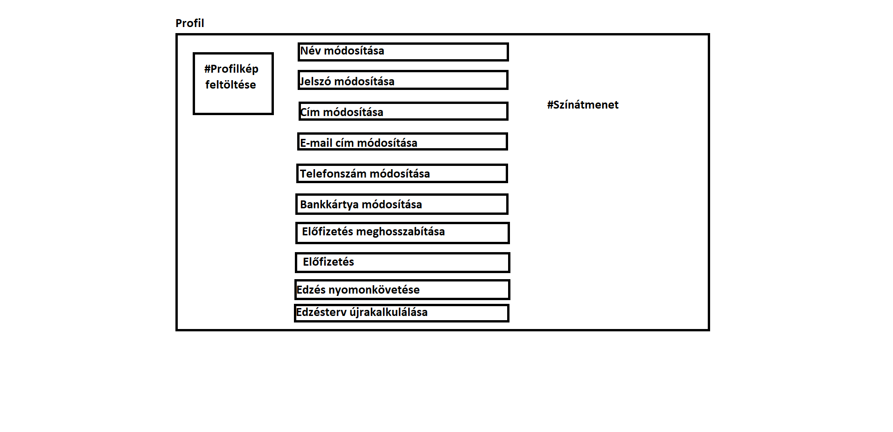| 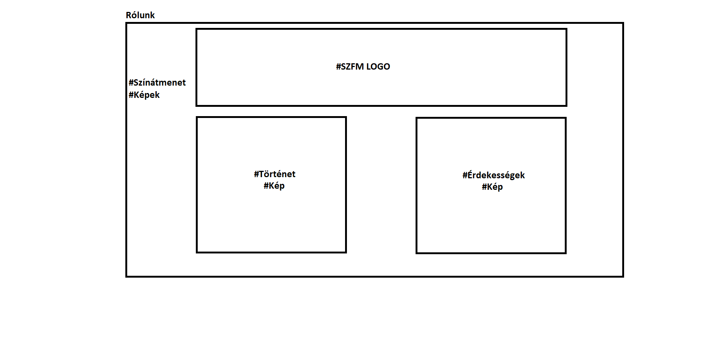
|:-----:|-----:|-----:|-----:|
|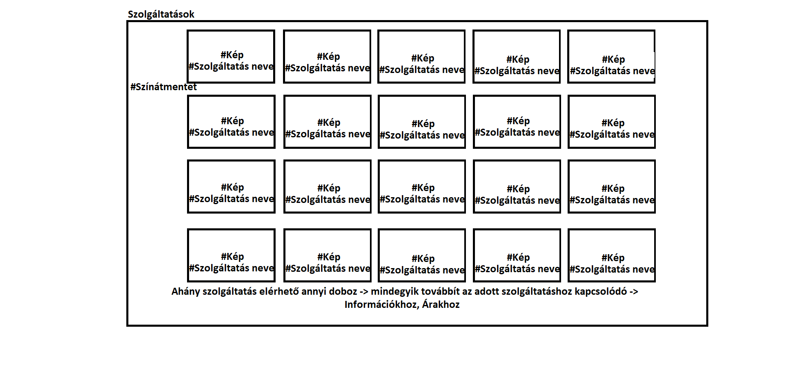|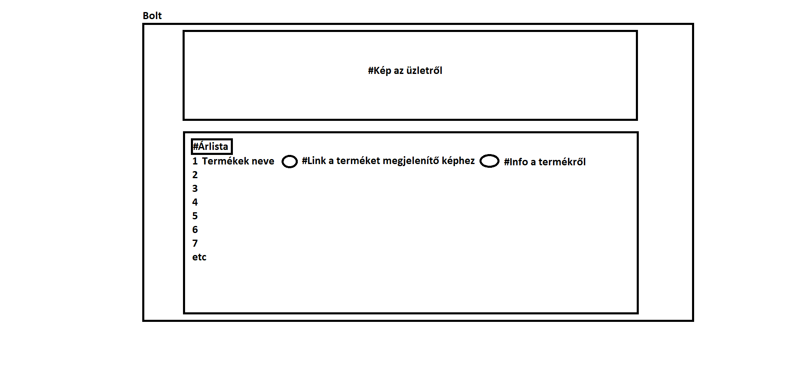|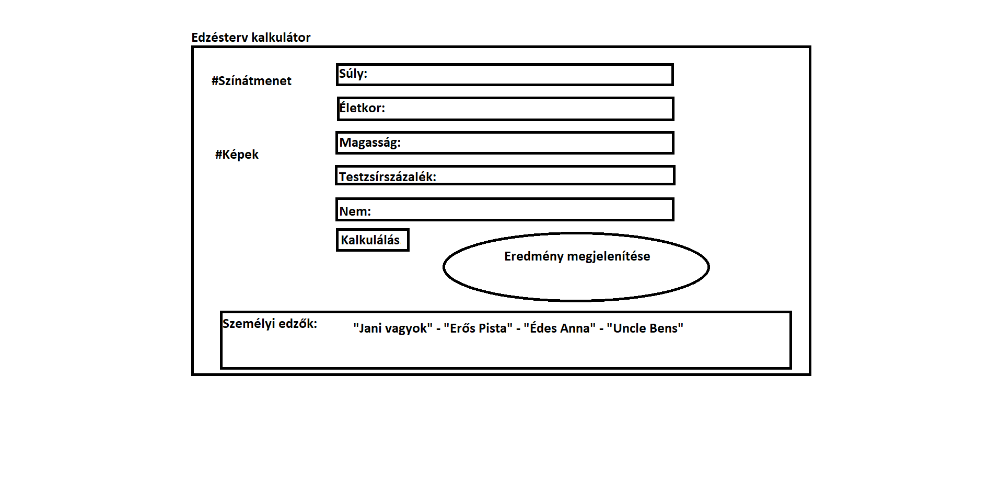|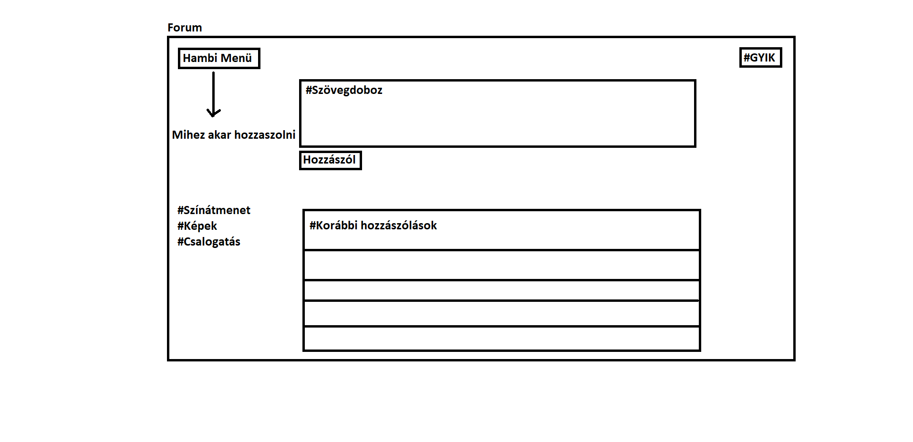|
|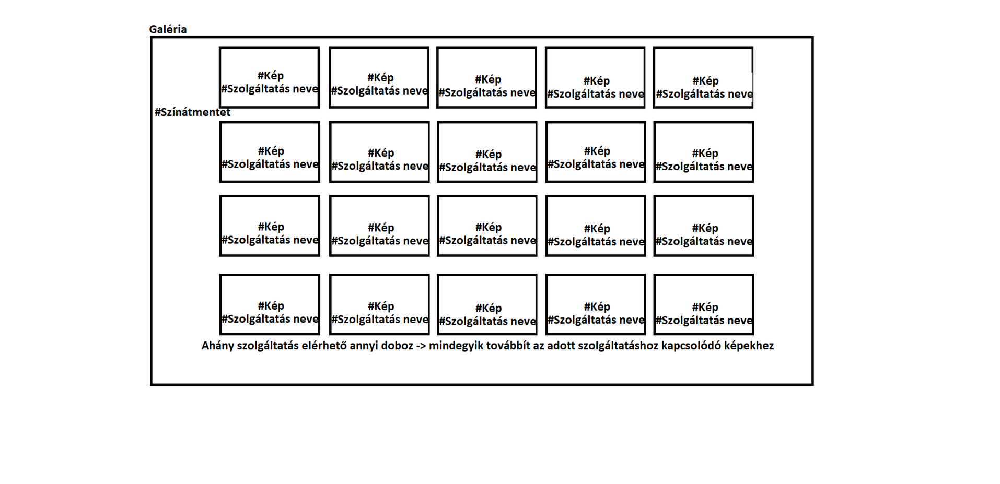|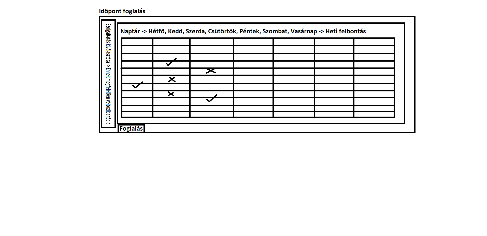|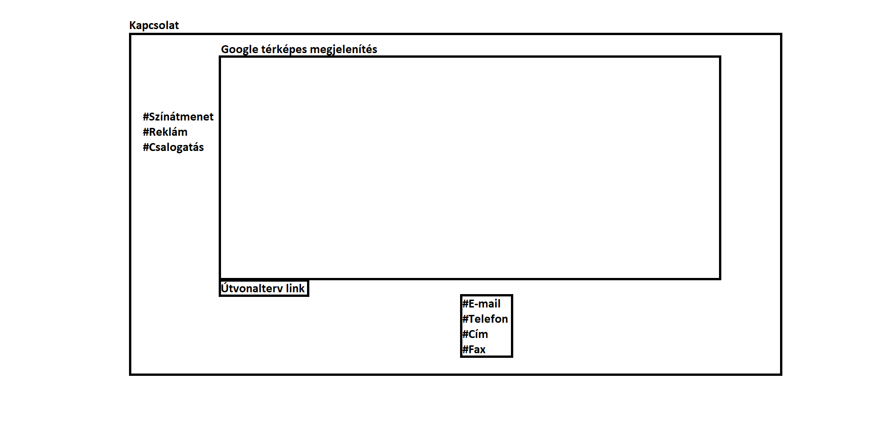|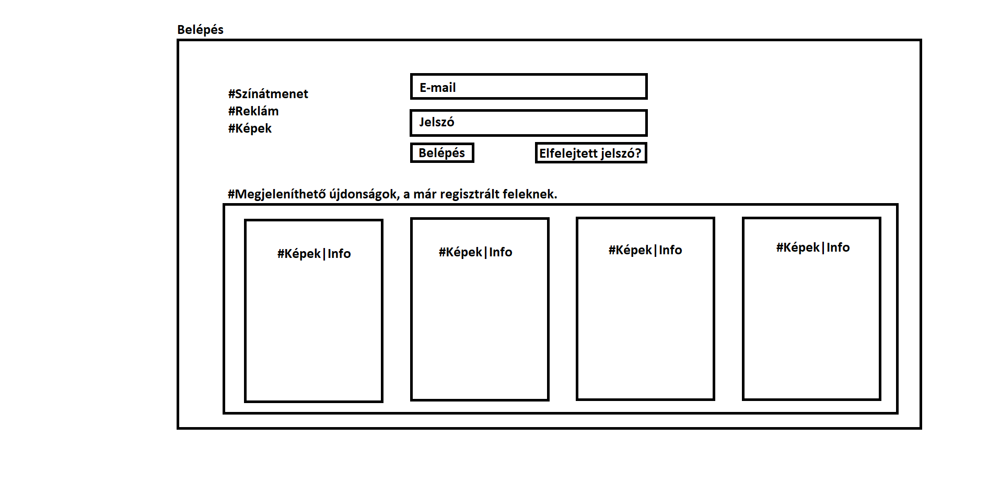