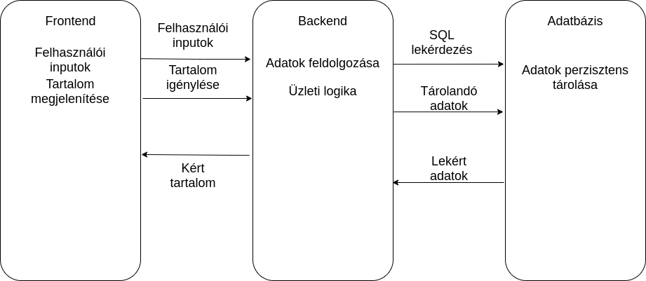

# Rendszerterv

## 1. A rendszer célja

Elsődleges célunk egy olyan weboldal létrehozása, ami tökéletesen lefedi az SZFM cég által nyújtott szolgáltatásokat. Ezen felül még tartalmaz sok informatív cikket és tanácsot az egészséges élettel kapcsolatban legyen szó a mozgásról, táplálkozásról, vagy pihenésről. A weboldalt egyszerűre és felhasználóbarátra tervezzük minden korosztály számára. Átlátható és könnyen bővíthető oldal létrehozására törekszünk. A felhasználók egy rövid regisztráció után könnyen be tudnak majd lépni az oldalra. 

Távolabbi céljaink, hogy a regisztrált felhasználóknak megnyíljanak további lehetőségek is, mint például a kalóriaszámláló vagy az edzésterv generáló oldal. Így az oldalra belépett felhasználó meg tudja határozni a napi szükséges kalória mennyiségét, valamint könnyen és egyszerűen tud készíteni edzéstervet az ő által szerkesztett gyakorlatokból.

## 2. Projekt terv

A mi cégünk egy fiatalokból álló lelkes kis csapat, akik örömmel dolgoznak olyan cégeknek, akik segíteni szeretnének megkönnyíteni az emberek mindennapjait vagy csak kellemes kikapcsolódásra vágynak.

A csapatunk négy főből áll, akik motiváltak, lelkesek és szeretik a kihívásokat. A munkát mindig a tudásunk és az eddigi tapasztalataink alapján osztjuk meg. Társaink mközül ketten jártasabbak a weboldal programozásban(Php), így ők csinálják a weboldal háttér munkáit. A másik két fő, pedig főként az oldal megjelenésével, a szövegekkel és a stílusokkal foglalkozik majd. 

Első lépésként felvettük a kapcsolatot a megrendelővel, majd elkészítettük a követelmény specifikációt, a funkcionális specifikációt, majd a rendszert tervet. Második lépésként jött maga a weboldal megalkotása, és az ehhez kapcsolódó háttér programozási is, mint például a regisztrációs és bejelentkező felület.

## 3. Üzleti folyamatok modellje

&nbsp;&nbsp;&nbsp;&nbsp;A felhasználó a weboldalt megnyitva, egy átlagos, letisztult képet fog kapni, ahol alapinformációkat szolgáltatunk a helyiségekről, illetve a menüsort felhasználva további funkciókat érhet el, melyekkel további tudásra tesz szert. 
Menüsor jellemzése a látogató szemszögéből:

**-> Bolt :**

    -- A bolt fület megnyitva, komplexumunk belsejében található üzletünkről kapnak információt. Termékeinket tudják megtekinteni, melyeket üzletünk tartalmaz. ( Pólók, Bögrék, Teák, Gyógynövények, és egyéb készítmények, amelyek hozzájárulnak az egészségesebb életmód kialakításához) 
    -- Ezen felül szolgáltatásaink árlistáját tekinthetik meg, melyen átláthatóan el tudják olvasni minek a használata/igénybevétele mennyibe is kerül. 
**-> Galéria :**

    -- A látogató, aktuális képeket tekinthet meg építmünykről és környékéről, szolgáltatásaink helyszínéről, illetve öltözőinkről, zuhanyzóinkról. Emellett életképeket láthatnak, melyek szimbolikus jelleggel próbálják reprezentálni a hangulatot, amely átjárja az épületegyüttest.

**-> Regisztráció:** 

    -- Egyértelmű kérdéseket teszünk, melyekkel elkérjük a regisztrálni akaró fél:  
        - nevét 
        - címét 
        - jelszavát 
        - e-mail címét 
        - telefonszámát
    -- Ezeken felül lehetőséget kínálunk előfizetett regisztrációra, amelyet ha kiválaszt, egy plusz információt kell megadni: a bankszámlaszámot 
    -- Előfizetett felhasználóként, kap cégünktől egy ingyenes felhasználási lehetőséget, bármelyik szolgáltatásunkra.
**-> Kapcsolat:**

    Egyértelmű elérhetőséget biztosítunk, cégünkkel kapcsolatban beleértve a térképes megjelenítést is.(Címünk, Telefonszámunk, E-mail címünk)
**-> Szolgáltatások:**

    Kategorizálva érheti el a pontokon keresztül mit szeretne a vendég igénybe venni, és a döntés megkönnyítése érdekében részletes leírást  kap a szolgáltatás  pozitív egészségügyi hatásairól.
**-> Rólunk:**

    Cégünk történelmének bemutatása és tömör információk juttatásokról.
    Plusz érdekességképpen pedig négy alapító önéletrajzáról olvashatnak.
**-> Belépés:**

    -- Ez a menüpont teszi lehetővé, a regisztrált feleknek a belépést, miután extra szolgáltatásként a weboldalon a fórumot is igénybe tudja venni, ahol véleményét kinyilvánítva tud segítséget nyújtani a további érdeklődők számára.
    -- Extra funkcióként időpontot tud foglalni a különböző programokra, és saját edzéstervet tudunk összeállítani neki, az edzésterv kalkulátor segítségével.
    -- A kalkulátor érdeklődik a regisztrált fél súlya, magassága, testzsírszázaléka,életkora és neme felől.
    -- Saját profilukat is megtudják tekinteni a regisztrált felek, hogy az adatmódosítás lehetőségét felkínáljuk, illetve ha elő szeretne fizetni mégis, akkor ezt megtudja tenni.
    --  Ezen adatok alapján pedig tökéletesen kiszámolja és kiadja a megfelelő edzéstervet, melyekhez kellő felszerelést biztosít intézményünk.

&nbsp;&nbsp;&nbsp;&nbsp;Az alkalmazottak is megkapják ezeket a funkciókat, viszont van pár extra, amelyek az ott dolgozói léttel járnak.
Ezek a belépést követően lesznek elérhetőek saját azonosítóik alapján. 

Ami extra: 

**-> Belépés:**

    -- Az alkalmazott megtudja tekinteni az aktuális havi bérét, hogy az adott hónapban mennyit is keresett.
    Saját személyre szabott edzéstervet tud kialakítani a kalkulátor igénybevétele nélkül. 
    -- Kap egy fület, amelyen keresztül a boltba tudja feltölteni az újabb termékeinket vagy levenni amelyik már elfogyott.Továbbá szolgáltatásaink leírását tudja módosítani,frissíteni,törölni.
    -- Megtekintheti a saját munkaidő beosztását, hogy az adott hónapban mikor is dolgozik, melyik napokon.

&nbsp;&nbsp;&nbsp;&nbsp;A cégvezető is tudja természetesen kezelni a felületet. Ami a vezető privilégiuma közé tartozik, hogy kezelni tudja: 

    -- Bérszámítást, ahol alkalmazottainak tud árakat szabni,
    -- Nyilván tudja tartani a jelen dolgozóinak listáját,
    -- Műszakokat tudja kezelni, tehát az időbeosztást tudja kialakítani.

## 4. Követelmények

 - Reszponzív weboldal létrehozása
 - Könnyen kezelhető felület
 - Regisztrációs - és belépést kezelő felület
 - Naprakész információk
 - Látványos ábrák és képek

## 5. Funkcionális terv

&nbsp;&nbsp;&nbsp;&nbsp;A fejlesztendő weboldalt minden olyan felhasználónak ajánlani tudjuk, akik rendelkeznek alapvető informatikai tudással. Gondolunk itt arra, hogy képes megnyitni egy böngészőt aztán rákeresni a weboldalra. A weboldal felépítésekor olyan elemeket használtunk amikkel már találkozott korábban a felhasználó. Pl.: Menüsor, Gombok, Szövegmező stb. Ezeket a különböző design trendekkel / módszerekkel még felhasználóbarátabbra lett tervezve.  
&nbsp;&nbsp;&nbsp;&nbsp;Az átlagfelhasználó általában azért fogja felkeresni az oldalt, hogy információt gyűjtsön magáról a komplexumról és szolgáltatásairól. Ehhez nincs szükség bejelentkezéshez csak annyi a dolga, hogy a felső menüsorból kiválasztja a szolgáltatások vagy kapcsolat menüpontok valamelyikét és máris naprakész információkat tud megtekinteni. Azok, akik már találkoztak / üdültek a komplexumban azok esetleg extra funkciókat (premium tagság, edzésterv kalkulátor stb.) is kipróbálnák, amit a weboldal nyújt. Erre már regisztrált tagság szükséges. Sikeres belépés után ezeket a funkciókat szintén eléri a menüsorból.   
&nbsp;&nbsp;&nbsp;&nbsp;Lényegében minden egyes topic / információ csoport elérhető a menüsoron keresztül.
Saját személyzetünkre vonatkozó weboldal funkciók szintén regisztrált tagság szükséges. Ezeket munkába álláskor / weboldal elkészültekor automatikusan ki fogjuk osztani és minden munkaügyhöz kapcsolódó funkciót elérnek majd.  

*kiegészítés később*
    
## 6. Fizikai környezet

&nbsp;&nbsp;&nbsp;&nbsp;Fizikai szerver létesítése és karbantartására nincs szükség a projekt szempontjából. A hosztolást egy szolgáltató fogja biztosítani.  
Szolgáltató lista:
- Hostinger
- HostGator
- ATW

&nbsp;&nbsp;&nbsp;&nbsp;Minden szolgáltatónak megvan a maga service csomagja. Az ügyféllel egyzetetve végül a ATW OptimalWeb Premium webtárhely szolgáltatását fogjuk igénybe venni. Amely kis és közepes méretű vállalkozásokra van szabva. Továbbá a csomaggal ingyenes SSL tanúsítványt, domaint is kapunk. A csomag összes funkciója felsorolva a [https://atw.hu/tarhely](https://atw.hu/tarhely) oldalon elérhető.  
&nbsp;&nbsp;&nbsp;&nbsp;Adatbázis szempontból se lesz sok teendő. A vásárolni kívánt csomagban ingyenes MySQL adatbázis és managelő platform áll rendelkezésre.  

**Fejlesztési szempontok / környezetek:**

&nbsp;&nbsp;&nbsp;&nbsp;Mivel webes platformra fejlesszünk ezért webes frontend, backend technológiákat fogunk alkalmazni. Ezekhez különböző fejlesztői környezetek (IDE)-k állnak rendelkezésre.  

**Frontend**  

- **Visual Studio Code** (terminál, EMET, verziókezelés, bővítmények hozzáadása lehetséges amely a különböző technológiák kódjaihoz ajánl kódkiegészítést, kiemelést (intellisense).
- **Atom** - ingyenes open-source szövegszerkesztő, amely a VS Code hoz hasonlóan testre szabható.
- **Sublime Text* 
- **Brackets**

**Backend**  

- **Visual Studio Code** (terminál, EMET, verziókezelés, bővítmények hozzáadása lehetséges amely a különböző technológiák kódjaihoz ajánl kódkiegészítést, kiemelést (intellisense).
- **JetBrains - PhpStorm** - IDE, light- heavy PHP applikációk fejlesztéséhez. 
- **phpMyAdmin** - MySQL menedzselő platform

**Egyéb környezetek / szoftverek / hardverek**  

- **XAMPP** - ingyenes, open-source szoftvercsomag.A local tesztelés és fejlesztéshez a PHP, MySQL, Apache2 szoftvercsomagokat 
- **Google Chrome** - webböngésző
- **Mozilla Firefox** - webböngésző
- **Safari** - Mac OS X webböngésző

## 7. Absztrakt domain modell

### Domain specifikáció  

Cégünk a weboldalt MVC architekturális modellt alkalmazva fogja megvalósítani. A Modell megfeleltethető az Adatbázisnak, a View megfeleltethető a Frontendnek, illetve a Control megfeleltethető a Backendnek.  
A megvalósítás menete három fő részre fog bomlani.  
1. Az adatbázis és az azon belüli táblák létrehozása  
    1. Ez az adatbázistervben leírt SQL kód használatával fog történni.  
2. A webalkalmazás fejlesztése  
    1. Frontend fejlesztés  
        1. Az alapvető megjelenés váza  
        2. A megjelenés dizájnja  
        3. Kliensoldali funkcionalitás  
3. Backend fejlesztés  
    1. Adatbáziskezelés  
    2. Adatok egyéb módon való feldolgozása  
    3. HTTP átirányítások kezelése  

### Fogalmak

**Frontend:** A weboldalnak azon része, amelyet a felhasználó meg tud tekinteni, illetve interakcióba léphet vele.

**Backend:** A weboldalnak azon része, amely az adatok feldolgozásáért felelős, illetve az üzleti logikát itt valósítjuk meg.

**Adatbázis:** Az adatok perzisztens tárolására szolgál.

**Perzisztens adattárolás:** Adatok hosszútávú tárolása.

**MVC (Model-View-Controll):** Háromrétegű tervezési minta, amely elkülöníti a felhasználói felületet, az üzleti logikát és az adatbázist vagy egyéb perzisztens adattárolási módszert.

### Absztrakt komponensek, ezek kapcsolatai

A rendszer fő komponensei a Frontend, Backend és az Adatbázis. A Frontend felelős a weblap megjelenítéséért. A Frontend az, amit a “felhasználó lát”, illetve interakcióba léphet. Ezek jelentik a weboldal tartalmát, a menüsorokat, stb. A Backend felelős az adatok feldolgozásáért, illetve a Frontend “kiszolgálásáért” és az Üzleti Logika megvalósításáért. Az Adatbázis felelős az adatok perzisztens tárolásáért.

Az ezek közötti kapcsolat a következő:
A Frontend részen megadja a felhasználó a feldolgozandó adatokat(felhasználónév, személyre szabott edzésterv, stb.), amely átküldi ezen adatokat a Backend részére, illetve a Backend továbbadhatja az adatokat az Adatbázisnak, amennyiben ezen adatokat perzisztensen tárolni szükséges.



Bejelentkezés esetén a következő folyamat játszódik le nagyvonalakban:
1. A felhasználó a bejelentkezési oldalon megadja a felhasználónevét és jelszavát.
2. Ezeket az adatokat a Frontend elküldi a Backend részére, amely megvizsgálja, hogy a bejelentkezéshez minden szükséges adatot megadott-e a felhasználó
    1. Amennyiben ez nem történt meg, a felhasználónak visszaküld a Backend egy hibaüzenetet, amely elmagyarázza, hogy miért nem sikerült a bejelentkezés.
    2. Amennyiben ez megtörtént, a Backend összehasonlítja a felhasználó által megadott adatokat az Adatbázisban tárolt adatokkal.
        1. Amennyiben a két adat megegyezik, a felhasználót a rendszer sikeresen authentikálta, majd a Backend elküldi a felhasználónak azt az oldalt, amelyre sikeres bejelentkezés után átirányítja a rendszer.
        2. Amennyiben a két adat nem egyezik meg, a Backend visszaküld a felhasználónak egy hibaüzenetet, amely elmagyarázza, hogy miért nem sikerült a belépés
3. A felhasználó sikeresen bejelentkezett.


## 8. Architekturális terv

&nbsp;&nbsp;&nbsp;&nbsp;Maga a rendszer tervezési mintája a három rétegű alkalmazást testesíti meg:

- Frontend 
- Internet 
- Webszerver/Alkalmazás szerver 
- Backend

**Főbb komponensek:**

**Front End->**

- Web böngésző
- Tartalom/Megjelenítés/Viselkedés
- Mobil böngésző

**Internet**

**MiddleWare->**

- Web server
- Alkalmazás szerver

**Back End->**

- Adatbázis 
- Egyéb szerver

A rendszer felépítését illetően, egy kliens-szerver modellt veszünk alapul, ahol az adat és a feldolgozás megoszlásának eloszlása a fő profil, a feldolgozó egységek között. 

- Kliensek
- Szerverek
- Hálózat 

**Általánosan: ->**

**Kliensek halmaza:**

- Szerverek által biztosított szolgáltatásokat fogják futtatni.
- Számos példány futhat egyidejűleg

**Hálózat:**

- Kliens hozzáférését biztosítja a szolgáltatásokhoz

**Szerverek halmaza:**
- Alrendszerek , számítógépek számára nyújt szolgáltatást

**Biztonság:** 
- HTTPS protokoll használata

A rendszer felbontását illetően a megvalósítás **objektumorientált felbontás** lesz:

- jól definiált interfészekkel rendelkező objektumok
- szolgáltatások más objektumok részére
- vezérlési modell használata 

**Változtathatóság:**
- egyszerű, mert az objektumok implementációja anélkül változtatható, hogy az hatással lenne más objektumokra.

**Vezérlési stílus:** 
- Eseményvezérelt rendszer


## 9. Adatbázis terv

### Az adatbázis UML modellje


### Tárolt eljárások

Tárolt eljárásokat nem fogunk alkalmazni.

### Fizikai adatmodellt legeneráló SQL szkript

```sql
CREATE TABLE USERS(
    ID NUMBER NOT NULL AUTO_INCREMENT,
    UNAME VARCHAR(60) NOT NULL,
    USERNAME VARCHAR(40) NOT NULL,
    UADDRESS VARHCAR(80) NOT NULL,
    EMAIL VARCHAR(60) NOT NULL,
    PHONE_NUMBER NUMBER NOT NULL,
    RANK_ID NUMBER,
    PRIMARY KEY (ID),
    CONSTRAINT FK_RANK_ID FOREIGN KEY (RANK_ID)
    REFERENCES RANKS(ID)
);

CREATE TABLE RANKS(
    ID NUMBER NOT NULL AUTO_INCREMENT,
    RNAME VARCHAR(20),
    PRIMARY KEY (ID)
);

CREATE TABLE CARDS(
    ID NUMBER NOT NULL AUTO_INCREMENT,
    USER_ID NUMBER,
    CARD_NUMBER NUMBER NOT NULL,
    PRIMARY KEY (ID),
    CONSTRAINT FK_USER_ID FOREIGN KEY (USER_ID) REFERENCES USERS(ID)
);

CREATE TABLE WAGES(
    ID NUMBER NOT NULL AUTO_INCREMENT,
    USER_ID NUMBER,
    WAGE NUMBER,
    PRIMARY KEY (ID),
    CONSTRAINT FK_USER_ID FOREIGN KEY (USER_ID) REFERENCES USERS(ID)
);

CREATE TABLE FORUM(
    ID NUMBER NOT NULL AUTO_INCREMENT,
    USER_ID NUMBER,
    CONTENT VARCHAR(400),
    PRIMARY KEY (ID),
    CONSTRAINT FK_USER_ID FOREIGN KEY (USER_ID) REFERENCES USERS(ID)    
);
```

## 10. Implementációs terv


## 11. Tesztterv

&nbsp;&nbsp;&nbsp;&nbsp;A tesztterv célja a tesztelés teljes körűségének biztosítása, a tesztelés során alkalmazott eljárások és megoldások meghatározásával. 

**Tesztelő:**

- teszt végrehajtása 
- észrevételek dokumentálása
- teszt dokumentáció archiválása

**Szakértő:**
- észrevételek elemzése, megoldás javaslata

**Teszt-koordinátor:**

- teszt terv készítése
- tesztterv jóváhagyása
- teszt forgatókönyvek létrehozása
- inkonzisztenciák kezelése
- helyes és időbeli hibakezelés
- projekt elkaszálása szükség esetén
- végső riport készítése
- teszt dokumentáció archiválása
- észrevételek státuszának követése illetve dokumentáélása

**Projektvezető:**
- teszt terv jóváhagyása
- tesztterv forgatókönyve

**Tesztkörnyezet:** 
- környezet neve és feladata
- hozzáférés módja
- konfiguráció
- kapcsolattartó személy

**Tesztadatok:**

- végrehajtáshoz szükséges rekordok
- elkészítésért , feltöltésért felelősök

**Tesztadatok leszállítása:**
- teszt terv: ->
- tesztesetek: ->
- tesztjegyzőkönyvek: ->
- tesztelési jelentés: ->
    - felelős személy
    - szállítási gyakoriság
    - szállítás módja

**Tesztelési eszközök:** 
- automatizált eszközök
- tesztelői csapat alkalmazása
- teszt-optimalizáló módszerek 

Sikeres tesztről akkor beszélünk, ha a korábban említett egyveleg minden pontja rendben zajlott le és ennek fejében nincs kifogásolható eredmény, amely valahol is hibát dobott volna.

pl.: Regisztráció, Belépés, Adatbázis funkcionalitások, Biztonság stb...

## 12. Telepítési Terv
A **felhasználót** illetően : 
- számítógép
- operációs rendszer feltelepítése 
- internet elérés
- bármelyik web böngésző letöltése/telepítése
- megfelelő url begépelése

A **céget** illetően a megvalósítás:
- XAMPP webszerver-szoftvercsomag
- ATW -> ingyenes webtárhely (Platformfüggetlen környezet) - https://atw.hu/ingyenes-webtarhely

**XAMPP** röviden, miért is praktikus számunkra.

    -- Az XAMPP egy szabad és nyílt forrású platformfüggetlen webszerver-szoftvercsomag, amelynek legfőbb alkotóelemei az Apache webszerver, a MariaDB adatbázis-kezelő, valamint a PHP és a Perl programozási nyelvek értelmezői (végrehajtó rendszerei). 
    -- Ez a szoftvercsomag egy integrált rendszert alkot, amely webes alkalmazások készítését, tesztelését és futtatását célozza, és ehhez egy csomagban minden szükséges összetevőt tartalmaz. 
    -- Egységes, átlátható és praktikus a megvalósítás szempontjából, hisz mindent elérünk ami számunkra a megvalósításhoz kell. 
**ATW** röviden, miért is gondolkodjunk el rajta: 

    -- Ingyenes webtárhely szolgáltatás amely 2003  augusztusában látott napvilágot.A szolgáltatás azáltal vált hamar ismertté, hogy versenytársakhoz képest jelentősen nagyobb tárhelyet tud biztosítani a felhasználók számára.

## 13. Karbantartási Terv

&nbsp;&nbsp;&nbsp;&nbsp;Informatikai szempontból a biztonság mindig is fontos volt - lesz, hogy ne engedjük az illetéktelen behatolók számára, hogy feltörjék ügyfeleink adatait vagy az ott dolgozók adatait, még rosszabb esetben a vezérigazgató belépési adatait.

&nbsp;&nbsp;&nbsp;&nbsp;Folyamatos frissítés és az aktuális protokolloknak megfelelő eljárásokat biztosítunk. 

&nbsp;&nbsp;&nbsp;&nbsp;Rendszeres biztonsági mentés készítése, illetve tartalomkezelő rendszer és a hozzá tartozó moduloknak, mindig a legfrissebb verzióra való frissítése amit nyújtunk.

&nbsp;&nbsp;&nbsp;&nbsp;Rendszeres karbantartás mellett szól a weboldal helyezési kérdése a google-t illetően.Folyamatos tesztelések végett - teljesítésének vizsgálata és gyorsaságának vizsgálata.

&nbsp;&nbsp;&nbsp;&nbsp;Folyamatos foglalkoztatottságnak köszönhetően, a weboldal helyezésének rangsorolása is kedvezőbb lesz.
**Összegezve tehát :** 
- Fejlesztések, Hibák kijavítása
- Új elemek létrehozása
- Oldalak felvétele, kialakítása, törlése
- Tartalomkezelő frissítése
- Havi több biztonsági mentés
- Tárhellyel kapcsolatos ügyintézések
